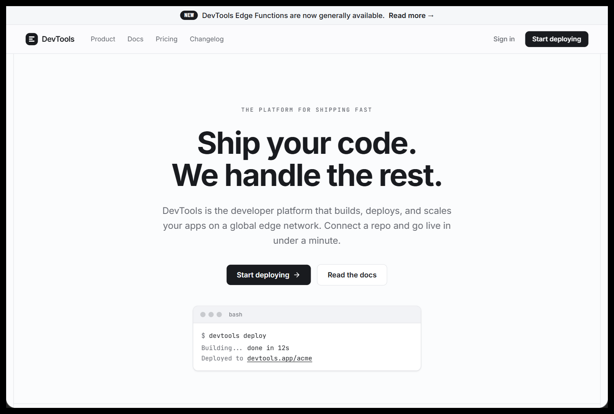

# Free SaaS Landing Page Template (React, Vue & HTML)

A clean, production-ready **SaaS landing page template** built on **Tailwind CSS**, in **React, Vue, and plain HTML**. This is the "DevTools" theme: a crisp, monochrome developer-tool style with a full multi-page layout (home, features, docs, pricing, changelog, blog, about, careers, contact, and legal pages).

Open source: this template is free and MIT licensed. You can use it in personal and commercial projects.

**[▶ Live demo](https://www.saasdesign.io/saas-landing-page-template/)**



## Quick start

See it running in the [live demo](https://www.saasdesign.io/saas-landing-page-template/). To run it locally, open **`html/index.html`** in your browser. No build step, no install. It loads Tailwind from a CDN and renders the full template.

For a real project, use the React or Vue component below.

## Use it with Claude Code, Cursor, or Codex

This template is built to hand straight to an AI coding agent. Drop the folder next to your project and ask, for example:

```
Add this SaaS landing page template to my app using the React version.
```

Your agent copies the component in and wires up the Tailwind tokens from `globals.css`.

## Frameworks

### HTML
Open `html/index.html` as-is, or copy the markup into your own page. It needs Tailwind CSS v4 and the tokens in `globals.css`. The standalone file already includes both, so it works on its own.

### React
`react/DevTools.tsx` is a single component with no required props:

```tsx
import { DevTools } from "./DevTools";

export default function App() {
  return <DevTools />;
}
```

Set up Tailwind CSS v4 and import `react/globals.css` once (it defines the design tokens). The component uses inline SVGs, so there are no icon dependencies.

### Vue
`vue/DevTools.vue` is a single-file component:

```vue
<script setup>
import DevTools from "./DevTools.vue";
</script>

<template>
  <DevTools />
</template>
```

Import `vue/globals.css` once for the tokens.

## What's included
- Eleven pages wired into one template: Home, Features, Docs, Pricing, Changelog, Blog, Post, About, Careers, Contact, and legal
- Light and dark mode from one set of tokens (add the `dark` class to a parent element)
- Fully responsive, semantic markup
- One design-token file (`globals.css`) so the whole look is tunable from one place

## Get the full set: 9 templates + the design system

This is **1 of 9** landing page templates from **[SaaS Design](https://www.saasdesign.io)**. The full set also includes the complete app UI (dashboards, data tables, settings, billing, auth, and onboarding) and the design system behind it, all as React, Vue, and HTML code you own.

**[See all 9 templates and the design system →](https://www.saasdesign.io/pricing/)**

The full bundle is a one-time **$19** (all 9 templates, the complete app UI, and the design system, no subscription).

Built for people shipping with AI coding tools:
- [Claude Code templates](https://www.saasdesign.io/claude-code-templates/)
- [Cursor templates](https://www.saasdesign.io/cursor-templates/)
- [Codex templates](https://www.saasdesign.io/codex-templates/)

## License

MIT. Free to use in personal and commercial projects. See [LICENSE](./LICENSE).

Made by [SaaS Design](https://www.saasdesign.io).
